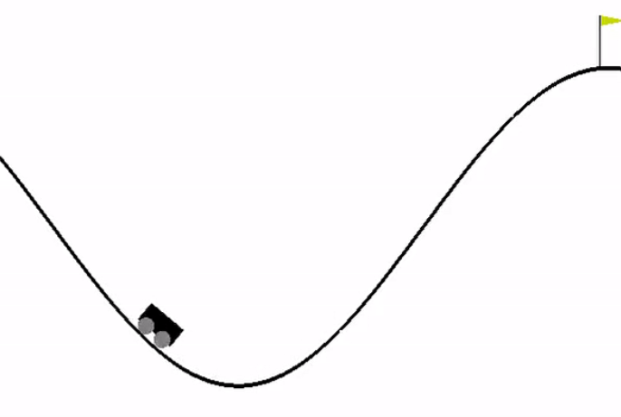
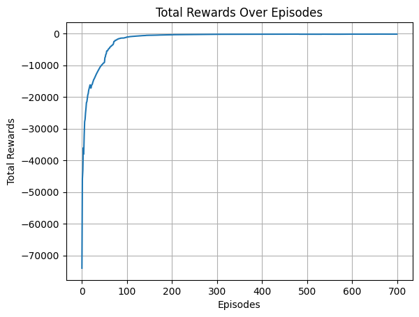

# Reinforcement Learning with Q-Learning for Mountain Car Environment

This repository contains a Python implementation of the Q-learning algorithm applied to the Mountain Car environment using the OpenAI Gym library. The Q-learning algorithm is a model-free reinforcement learning technique that allows an agent to learn optimal strategies in an environment by estimating the value of different state-action pairs.

## Basics of Reinforcement Learning and Q-Learning

Reinforcement Learning (RL) is a paradigm in machine learning where an agent learns to make decisions by interacting with an environment. The agent receives feedback in the form of rewards or penalties, and its objective is to learn a policy that maximizes the cumulative reward over time.

Q-Learning is a popular RL algorithm that deals with the problem of making decisions in a partially observable environment. The algorithm maintains a Q-table, where each entry represents the expected cumulative future reward for taking a specific action in a particular state. Through exploration and exploitation, the agent updates its Q-values based on the observed rewards and refines its decision-making policy.

## Mountain Car Environment

The Mountain Car environment is a classic problem in RL, where an underpowered car must build enough momentum to reach the top of a hill. The car can apply a force in the interval [-0.07, 0.07] to move backward, stay still, or move forward, respectively. The challenge is that the car cannot reach the goal directly but must learn to oscillate back and forth to gain enough energy to surmount the hill. Find more information about the [Mountain Car environment](https://gymnasium.farama.org/environments/classic_control/mountain_car/).

## Code Overview

The repository consists of three main files:

1. **main.py**: Implements the Q-learning algorithm for training the agent in the Mountain Car environment. It uses functions from the utils.py file for state discretization, action selection, and visualization.

2. **utils.py**: Contains utility functions for state discretization, action selection, creating the environment space, and plotting mean rewards. It also includes functions to save and load the Q-value function.

3. **render_episode.py**: Renders a trained episode using the saved Q-values.

## Instructions

To train the agent, run `main.py`. The script will save the learned Q-values, a plot of the mean rewards over episodes, and an animation of a trained episode.

To render a trained episode, run `render_episode.py`. This script loads the saved Q-values and generates an animation.

## Mean Rewards Plot

## Rendered Episode

For more details on the code and the Mountain Car problem, refer to the comments in the source files.

Feel free to explore and experiment with the code to gain a deeper understanding of Q-learning and its application to the Mountain Car environment.
